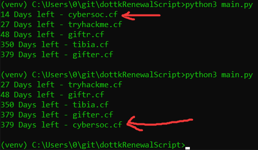
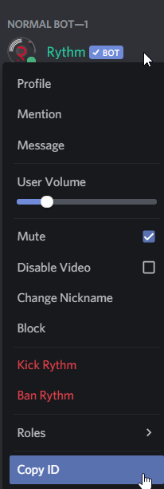

## Freenom.com Domain Renewal Script



## How to setup this script on Windows?
```
python3 -m ven venv
venv\Scripts\activate.bat
pip3 install -r requirements.txt
python3 main.py
```
## How to get discord id?



## Where can I get firefox webdriver?
https://github.com/mozilla/geckodriver/releases/tag/v0.28.0

# Config.ini
config.ini
```
[account]
user = exaple@gmail.com
pasw = SuperUltraSecurePassword123

[notifications]
notifyMe = True
webhookUrl = https://discord.com/api/webhooks/796632508744597516/aXUKOYD1A-Yk7_Z0pJ3ozOQs0UEXReMOxVhgCMG3V8meshNUKJtTd0l_JGVHgY0haWGa
userDiscord = <@235088799074484224>
```